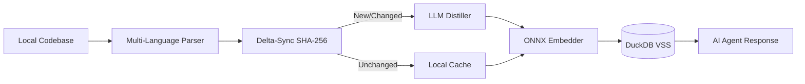

# agent-coderag

<p align="center">
  
</p>

<p align="center">
  <b>The API Knowledge Bridge for AI Coding Agents.</b><br>
  Local, fast, and token-efficient semantic search that eliminates LLM hallucinations by providing real-time local context.
</p>

<p align="center">
  <a href="https://github.com/naranor/agent-coderag/actions/workflows/ci.yml"></a>
  <a href="https://pypi.org/project/agent-coderag/"></a>
  <a href="https://github.com/naranor/agent-coderag/blob/main/LICENSE"></a>
  <a href="https://codecov.io/gh/naranor/agent-coderag"></a>
</p>

<p align="center">
  <a href="#key-features">Features</a> •
  <a href="#quick-start">Quick Start</a> •
  <a href="#how-it-works">Architecture</a> •
  <a href="#agent-native-usage">AI Agent Guide</a> •
  <a href="#contributing">Contributing</a>
</p>

---

## Why agent-coderag?

In 2026, AI coding agents are limited by stale training data. They hallucinate library calls because they don't know your specific environment.

*   **The Pain:** Your agent writes code for Pydantic v1 while you have v2 installed. You waste 5000+ tokens in a "Fail-Fix-Fail" loop.
*   **The Cure:** agent-coderag extracts live API signatures and technical intent from your local environment. It feeds the LLM exactly what it needs to see—no more, no less.

---

## Key Features

- **Instant Startup:** Built on onnxruntime and Rust-based tokenizers. Zero PyTorch overhead.
- **Context Compression:** Replace 10,000 lines of raw code with a 200-token semantic summary.
- **Universal Tree-Sitter Parser:** Supports 25+ languages (Python, JS/TS, Rust, Java, C++, Go, Ruby, etc.) with high precision.
- **API Discovery:** On-the-fly extraction of public signatures from Maven/Gradle caches and Python site-packages.
- **Local First:** All embeddings and data stay on your machine in a high-performance DuckDB VSS index.

---

## Quick Start

### Installation
```bash
pip install agent-coderag
# Install tree-sitter grammars for your languages on-demand
pip install tree-sitter-python tree-sitter-javascript
```

### Initial Setup
```bash
# Download pre-trained multilingual embedding models (~130MB)
agent-coderag setup

# (Optional) Connect your preferred LLM for semantic distillation
# Using Ollama (Local)
agent-coderag config --url "http://localhost:11434" --provider "ollama" --model "qwen2.5-coder"

# Using OpenAI-compatible API (e.g. Groq, OpenRouter, DeepSeek)
agent-coderag config --url "https://api.deepseek.com" --key "your-api-key" --model "deepseek-chat"
```

### Offline Mode (No Provider)
If you don't configure an LLM provider, agent-coderag works in **100% Offline Mode**:
- **Parsing & API Discovery:** Still works perfectly using local Tree-Sitter grammars and javap.
- **Search:** Remains fast and accurate.
- **Distillation:** Instead of AI-generated summaries, the system uses code signatures and entity names as fallback metadata. No data ever leaves your machine.

### First Sync & Search
```bash
# Index your entire project (respects .gitignore automatically)
agent-coderag sync --all

# Perform a semantic search
agent-coderag search "how does the authentication middleware work?"
```

---

## How It Works

agent-coderag creates a semantic map of your codebase using a multi-stage pipeline:



1.  **Structural Parsing:** Identifies classes, methods, and relations (imports).
2.  **Technical Distillation:** Generates a concise "intent summary" of each code unit.
3.  **Vectorization:** Local ONNX model creates 384-dimensional embeddings.
4.  **VSS Storage:** DuckDB enables sub-millisecond similarity search.

---

## Agent-Native Usage

agent-coderag is designed to be the primary tool for your AI agents.

### The Protocol:
1.  **Search First:** Instead of reading files, the agent runs agent-coderag --json search.
2.  **Verify Signatures:** The agent runs agent-coderag api <lib> to get real signatures.
3.  **Read Summaries:** The agent uses the summary field to decide which files are actually relevant.

**Programmatic Output:**
```bash
agent-coderag --json search "database init" --limit 1
```

---

## Development & Testing

We maintain a strict quality bar.

```bash
# Install development dependencies
make install

# Run full test suite with coverage
make test

# Run linters (Prospector, MyPy, Bandit)
make lint
```

---

## Contributing

Contributions make the open source community an amazing place to learn, inspire, and create.

1. Fork the Project
2. Create your Feature Branch (git checkout -b feature/AmazingFeature)
3. Commit your Changes (git commit -m 'feat: add AmazingFeature')
4. Push to the Branch (git push origin feature/AmazingFeature)
5. Open a Pull Request

---

## License

Distributed under the MIT License. See LICENSE for more information.

[🔝 Back to top](#table-of-contents)

<p align="center">
  <i>Built for agents. Driven by humans.</i>
</p>
