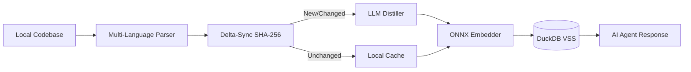

# agent-coderag

<p align="center">
  
</p>

<p align="center">
  <b>The API Knowledge Bridge for AI Coding Agents.</b><br>
  Local, fast, and token-efficient semantic search that eliminates LLM hallucinations by providing real-time local context.
</p>

<p align="center">
  <a href="https://github.com/naranor/agent-coderag/actions/workflows/ci.yml"></a>
  <a href="https://pypi.org/project/agent-coderag/"></a>
  <a href="https://github.com/naranor/agent-coderag/blob/main/LICENSE"></a>
  <a href="https://codecov.io/gh/naranor/agent-coderag"></a>
</p>

<p align="center">
  <a href="#key-features">Features</a> •
  <a href="#quick-start">Quick Start</a> •
  <a href="#how-it-works">Architecture</a> •
  <a href="#agent-native-usage">AI Agent Guide</a> •
  <a href="#contributing">Contributing</a>
</p>

---

## Why agent-coderag?

In 2026, AI coding agents are limited by stale training data. They hallucinate library calls because they don't know your specific environment.

*   **The Pain:** Your agent writes code for Pydantic v1 while you have v2 installed. You waste 5000+ tokens in a "Fail-Fix-Fail" loop.
*   **The Cure:** agent-coderag extracts live API signatures and technical intent from your local environment. It feeds the LLM exactly what it needs to see—no more, no less.

---

## Key Features

- **Instant Startup:** Built on onnxruntime and Rust-based tokenizers. Zero PyTorch overhead.
- **Context Compression:** Replace 10,000 lines of raw code with a 200-token semantic summary.
- **Universal Tree-Sitter Parser:** Supports 25+ languages (Python, JS/TS, Rust, Java, C++, Go, Ruby, etc.) with high precision.
- **API Discovery:** On-the-fly extraction of public signatures for 6 core ecosystems (Python, Java, Go, TypeScript, Rust, C#) with build-system awareness.
- **Local First:** All embeddings and data stay on your machine in a high-performance DuckDB VSS index.

---

## Quick Start

### Installation
```bash
pip install agent-coderag
# Install tree-sitter grammars for your languages on-demand
pip install tree-sitter-python tree-sitter-javascript
```

### Initial Setup
```bash
# Download pre-trained multilingual embedding models (~130MB)
agent-coderag setup

# (Optional) Connect your preferred LLM for semantic distillation
# Using Ollama (Local)
agent-coderag config --url "http://localhost:11434" --provider "ollama" --model "qwen2.5-coder"

# Using OpenAI-compatible API (e.g. Groq, OpenRouter, DeepSeek)
agent-coderag config --url "https://api.deepseek.com" --provider "openai" --key "your-api-key" --model "deepseek-chat"
```

### Offline Mode (No Provider)
If you don't configure an LLM provider, agent-coderag works in **100% Offline Mode**:
- **Parsing & API Discovery:** Still works perfectly using local Tree-Sitter grammars and javap.
- **Search:** Remains fast and accurate.
- **Distillation:** Instead of AI-generated summaries, the system uses code signatures and entity names as fallback metadata. No data ever leaves your machine.

Remote embeddings are **not** 100% Offline Mode. If you set `embedding_base` + `embedding_model`, `sync` / `search` / `rebuild` need the network. Embedder choice is process-global (`config.json`); after a remote model or dimension change, run `agent-coderag rebuild` (or delete that `--db`) for **each** project index.

```bash
agent-coderag config \
  --embedding-url "http://localhost:8081/v1" \
  --embedding-model "text-embedding-3-small" \
  --embedding-key "your-api-key" \
  --embedding-provider "openai"

agent-coderag config --clear-embedding
```

### First Sync & Search
```bash
# Index your entire project (respects .gitignore automatically)
agent-coderag sync --all

# Trusted Maven/Gradle projects only: allow dependency resolution
agent-coderag sync --all --allow-build-execution

# Perform a semantic search
agent-coderag search "how does the authentication middleware work?"
```

Dependency build execution is disabled by default. Maven and Gradle build files
can execute repository-controlled code, so use `--allow-build-execution` only
after you have reviewed and trust the project.

### API Discovery
Verify external library signatures without leaving the CLI:
```bash
# Explicit language selection (Recommended for multi-language repos)
agent-coderag api requests --lang python
agent-coderag api lodash --lang typescript
agent-coderag api serde --lang rust

# Built-in auto-detection for common project types (Cargo.toml, package.json, etc.)
agent-coderag api fmt
```

---

## Library Usage

> **1.4.0 migration:** Storage lifetime and default DB resolution changed. Pin `agent-coderag<1.4` until you adapt (see [Database & lifetime](#database--lifetime)).

```python
from pathlib import Path

from code_rag import CodeRAG, default_db_path

async def main():
    root = Path(".")
    print(default_db_path(root))  # resolved path before first sync

    # db=None (default): legacy code_rag.db in cwd/root, else root/.coderag.db
    async with CodeRAG(root=root) as rag:
        await rag.setup()
        await rag.sync(index_all=True)
        hits = await rag.search("authentication middleware", limit=5)
        # Opens the DB only when a provider needs it (e.g. Java JAR cache).
        report = await rag.api("pydantic", lang="python")
```

### Database & lifetime

- **Default path (`db=None`):** resolution order is (1) `./code_rag.db` if it exists, (2) else `{root}/code_rag.db` if it exists, (3) else `{root}/.coderag.db` (created on first `sync`/`rebuild`). Use `default_db_path(root)` to preview. New projects: prefer `.coderag.db` (step 3) or set `db=` explicitly.
- **Explicit path:** `CodeRAG(db=...)` / `agent-coderag --db ...`. Path is a **file**, not a directory. Relative paths resolve against **process cwd**, not `root`.
- **Sidecars:** DuckDB may write WAL sidecars (e.g. `.coderag.db.wal`) beside the index during writes; locks should not persist after an operation finishes.
- **Connect timeout:** `connect_timeout_seconds=5` (CLI `--connect-timeout`) waits on file locks, then raises `StorageBusyError` (`ErrorCode.STORAGE_BUSY`). Pass `0` for a single attempt.
- **Read-only search:** `search` (and `api` when storage is needed) opens read-only. A missing **index file** is an error — use `sync`/`rebuild` to create it. An index file that exists but has no embeddings table (e.g. opened/written without a completed vector sync) raises `StorageError` with `ErrorCode.EMBEDDINGS_MISSING` — run `sync` (library: `CodeRAG.sync`) before search. With `--json`, success is a hit array; errors are `{"status":"error","message":...}` and include `"code"` when the exception carries an `ErrorCode`.
- **Paths:** `sync` stores paths relative to `root` (`src/a.py`). The first sync rewrites an older absolute index when the file is still under `root` or its unit hashes match a file in the tree. Search returns an absolute path under the current root. `search --relative-paths`, config `relative_paths: true`, or `CodeRAG(relative_paths=True)` returns the stored relative path. Until that sync runs, search returns the absolute path stored in the index. Ignore rules use the same project-relative path, so a `.worktrees/<name>` checkout is indexed when that directory is the root.
- **Lifetime:** embedder/parser/distiller stay warm; DuckDB opens per operation and closes afterward. One `CodeRAG` instance serializes overlapping ops. `config()` with embedding flags / `--clear-embedding` closes the process embedder so the next op rebuilds it; distill-only `config` refreshes Distiller and keeps the embedder.
- **`api()` without DB:** providers that do not need the index (e.g. Python) skip DuckDB entirely; Java uses a short read-only open for JAR cache lookup.
- **Errors:** catch `CodeRAGError` and inspect `.code` — `STORAGE_BUSY`, `STORAGE_CORRUPT`, `EMBEDDING_MISMATCH`, `EMBEDDINGS_MISSING` (`from code_rag import ErrorCode`).

---

## Supported Ecosystems (Discovery)

| Language | Method | Discovery Source |
| :--- | :--- | :--- |
| **Python** | 3-Stage Probe | `.pyi` stubs, static source, or runtime `inspect` |
| **Java** | Bytecode Reflection | JARs resolved via Maven or Gradle with explicit `--allow-build-execution` opt-in |
| **Go** | Standard Tooling | Native `go doc -all` integration |
| **TypeScript/JS** | Declaration Maps | `.d.ts` files from `node_modules` or `@types` |
| **Rust** | Registry Analysis | Source code from Cargo registry via `cargo metadata` |
| **C#** | Assembly Metadata | DLL metadata via `dnfile` and XML documentation |

---

## How It Works

agent-coderag creates a semantic map of your codebase using a multi-stage pipeline:



1.  **Structural Parsing:** Identifies classes, methods, and relations (imports).
2.  **Technical Distillation:** Generates a concise "intent summary" of each code unit.
3.  **Vectorization:** Local ONNX model creates 384-dimensional embeddings.
4.  **VSS Storage:** DuckDB enables sub-millisecond similarity search.

---

## Agent-Native Usage

agent-coderag is designed to be the primary tool for your AI agents.

### The Protocol:
1.  **Search First:** Instead of reading files, the agent runs agent-coderag --json search.
2.  **Verify Signatures:** The agent runs agent-coderag api <lib> to get real signatures.
3.  **Read Summaries:** The agent uses the summary field to decide which files are actually relevant.

**Programmatic Output:**
```bash
agent-coderag --json search "database init" --limit 1
```

---

## Development & Testing

We maintain a strict quality bar.

```bash
# Install development dependencies
make install

# Run full test suite with coverage
make test

# Run linters (Prospector, MyPy, Bandit)
make lint
```

---

## Contributing

Contributions make the open source community an amazing place to learn, inspire, and create.

1. Fork the Project
2. Create your Feature Branch (git checkout -b feature/AmazingFeature)
3. Commit your Changes (git commit -m 'feat: add AmazingFeature')
4. Push to the Branch (git push origin feature/AmazingFeature)
5. Open a Pull Request

---

## License

Distributed under the MIT License. See LICENSE for more information.

[🔝 Back to top](#table-of-contents)

<p align="center">
  <i>Built for agents. Driven by humans.</i>
</p>
