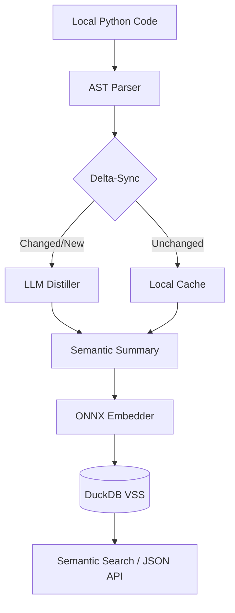

# Agent-CodeRAG

<p align="center">
  
</p>

> **Fast. Local. Agent-First. Token-Efficient.** Bridge the gap between AI coding agents and your local environment.

[](https://www.python.org/downloads/)
[](https://opensource.org/licenses/MIT)
[](https://pypi.org/project/agent-coderag/)
[](https://pypi.org/project/agent-coderag/)
[](https://github.com/naranor/agent-coderag/actions/workflows/ci.yml)
[](https://github.com/naranor/agent-coderag/actions)

---

## Table of Contents

- [Why Agent-CodeRAG?](#why-agent-coderag)
- [Quick Start](#quick-start)
- [Features](#-features)
- [How It Works](#-how-it-works)
- [API Discovery](#-api-discovery)
- [For AI Agents](#-for-ai-agents)
- [Development](#-development)
- [Contributing](#-contributing)
- [License](#-license)

---

## Why Agent-CodeRAG?

AI coding agents often **hallucinate** when calling library APIs because their training data is static. This leads to a **"Fail-Fix-Fail" cycle** — broken code, token waste, and frustration.

**The Problem:** Your agent knows Pydantic v1 (`model.dict()`), but your environment uses v2 (`model.model_dump()`). Result: 5000+ wasted tokens trying to "fix" something it doesn't understand.

**The Solution:** Agent-CodeRAG extracts *actual* API signatures from your installed libraries and provides the LLM with real-time, environment-specific context — saving up to **80% of context window tokens**.

[🔝 Back to top](#table-of-contents)

---

## Quick Start

```bash
# 1. Install
pip install agent-coderag

# 2. Setup (download ONNX model)
agent-coderag setup

# 3. Configure LLM (optional, for AI distillation)
agent-coderag config --url "http://localhost:11434" --provider "ollama" --model "qwen2.5-coder:7b"

# 4. Index your project
agent-coderag sync --all

# 5. Search
agent-coderag search "how to handle errors"
```

**Docker:**
```bash
docker build -t agent-coderag .
docker run -v ~/.cache/agent-coderag:/root/.cache/agent-coderag agent-coderag setup
```

[🔝 Back to top](#table-of-contents)

---

## ✨ Features

- **⚡ No PyTorch** — Uses `onnxruntime` and `tokenizers` (Rust) for instant startup
- **💾 DuckDB VSS** — High-performance vector search in a single local file
- **🏗️ Multi-Language** — Native indexing for Python (AST) and Java (javalang)
- **🔄 Delta-Sync** — SHA-256 hashing re-distills only changed code
- **🔌 Hybrid Intelligence** — Works offline; adds AI-distilled reasoning when LLM is connected
- **📡 API Discovery** — Extract live API signatures from Python modules or Java JARs

[🔝 Back to top](#table-of-contents)

---

## 🛠 How It Works



1. **AST Parser** — Parses your Python code
2. **Delta-Sync** — Uses SHA-256 to detect changes
3. **LLM Distiller** — Generates semantic summaries (optional)
4. **ONNX Embedder** — Creates embeddings locally
5. **DuckDB VSS** — Stores vectors for fast similarity search

[🔝 Back to top](#table-of-contents)

---

## 📡 API Discovery

```bash
agent-coderag api pydantic
```

Returns the *live* public API, methods, and signatures for any installed library.

[🔝 Back to top](#table-of-contents)

---

## 🤖 For AI Agents

Agent-CodeRAG is built for programmatic consumption:

1. **Search First**: `agent-coderag --json search "topic" --limit 1`
2. **Use Intent**: The `summary` field provides technical intent — skip reading unnecessary files

[🔝 Back to top](#table-of-contents)

---

## 🔧 Development

```bash
# Run tests
pytest tests/
pytest e2e_tests/

# Setup pre-commit hooks
pip install pre-commit
pre-commit install
```

[🔝 Back to top](#table-of-contents)

---

## 🤝 Contributing

Contributions are welcome! Here's how to get started:

1. **Fork** the repository
2. **Clone** your fork: `git clone https://github.com/YOUR_USERNAME/agent-coderag.git`
3. **Create a branch**: `git checkout -b feature/your-feature`
4. **Make changes** and commit with [Conventional Commits](https://www.conventionalcommits.org/)
5. **Run tests**: `pytest tests/`
6. **Push** to your fork and create a **Pull Request**

See [CONTRIBUTING.md](CONTRIBUTING.md) for detailed guidelines.

[🔝 Back to top](#table-of-contents)

---

## 📄 License

MIT © 2026 [Igor Boloban](https://github.com/naranor)

[🔝 Back to top](#table-of-contents)