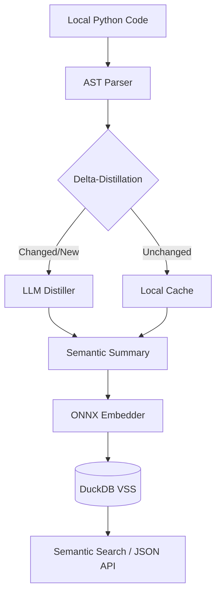

# CodeRAG: Semantic Intelligence for AI Coding Agents

> **Fast. Local. Agent-First. Token-Efficient.**

[](https://www.python.org/downloads/)
[](https://opensource.org/licenses/MIT)
[](#key-technologies)

---

## 🧠 The Problem: The API Knowledge Gap

AI coding agents often hallucinate when calling library APIs because their training data is static. This leads to a "Fail-Fix-Fail" cycle:

1.  **Broken Code**: Agents use deprecated parameters or non-existent methods from outdated versions.
2.  **Token Waste**: You provide the error, the agent tries to fix it using more outdated data, consuming thousands of tokens in a loop.
3.  **Environment Mismatch**: The agent knows the API for version 1.0, but your environment has 2.0.

### Real-world Example (The Pydantic Gap)
*   **Agent's Knowledge**: Knows Pydantic v1 (`model.dict()`).
*   **Your Environment**: Uses Pydantic v2 (`model.model_dump()`).
*   **The Result**: The agent writes `dict()`, the code fails, and it wastes **5000+ tokens** trying to "fix" a problem it doesn't understand.

## 🚀 The Solution: Real-Time Contextual Truth

CodeRAG acts as a lightweight semantic bridge between your local environment and the LLM. 

*   **API Discovery**: Extracts *actual* signatures from your installed libraries.
*   **Semantic Retrieval**: Provides the LLM with the exact "Intent" of your code units, indexed locally via ONNX.
*   **Token Efficiency**: Instead of sending whole files, CodeRAG distills code into compact semantic summaries, saving up to 80% of context window tokens.

---

## 🛠 How it Works



### Key Technologies
*   **No PyTorch**: Uses `onnxruntime` and `tokenizers` (Rust) for a tiny footprint (~50MB vs ~1GB).
*   **DuckDB**: High-performance vector similarity search stored in a single local file.
*   **LiteLLM**: Support for 100+ LLM providers (OpenAI, Anthropic, Ollama, etc.) for distillation.
*   **Delta-Sync**: Uses SHA-256 hashing to only re-distill changed code, saving your API budget.

---

## 🏃 Quick Start

### 1. Install
```bash
pip install .
```

### 2. Setup AI Models
Download the lightweight `paraphrase-multilingual-MiniLM` ONNX model to your global cache:
```bash
code-rag setup
```

### 3. Configure your LLM (For Distillation)
```bash
code-rag config --url "http://your-proxy:8383/v1" --model "gpt-4o"
```

### 4. Index your Project
```bash
code-rag sync --all
```

### 5. Search
*   **Human Mode**: `code-rag search "how to handle errors"`
*   **Agent Mode (JSON)**: `code-rag --json search "data storage" --limit 3`

---

## 📡 API Discovery
To help your agent understand a specific library version installed in your environment:
```bash
code-rag api pydantic
```
Returns the *live* public API, methods, and signatures.

## 🔌 Hybrid Intelligence: Works Offline
CodeRAG is useful even without an LLM:
*   **Offline Mode**: Uses **Fallback Embeddings** (based on names and signatures).
*   **AI-Enhanced Mode**: Adds a "Reasoning Layer" via LLM distillation to explain code intent.

---

## 🤖 For AI Agents
If you are an AI Agent, use this tool to explore the codebase without reading every file. Prefer `--json` output for parsing.

## 📄 License
MIT © Igor Boloban
